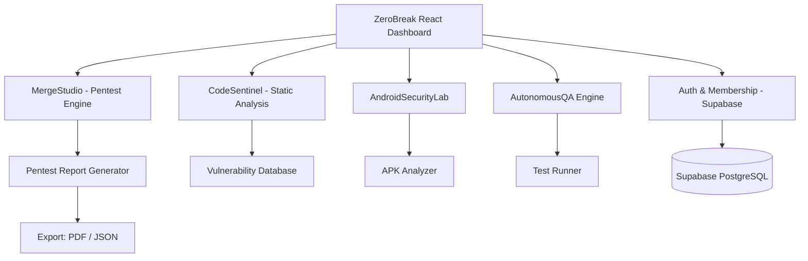
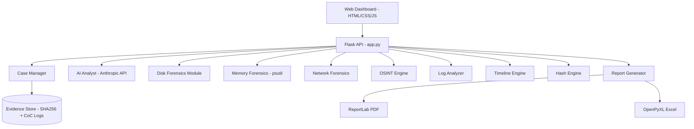
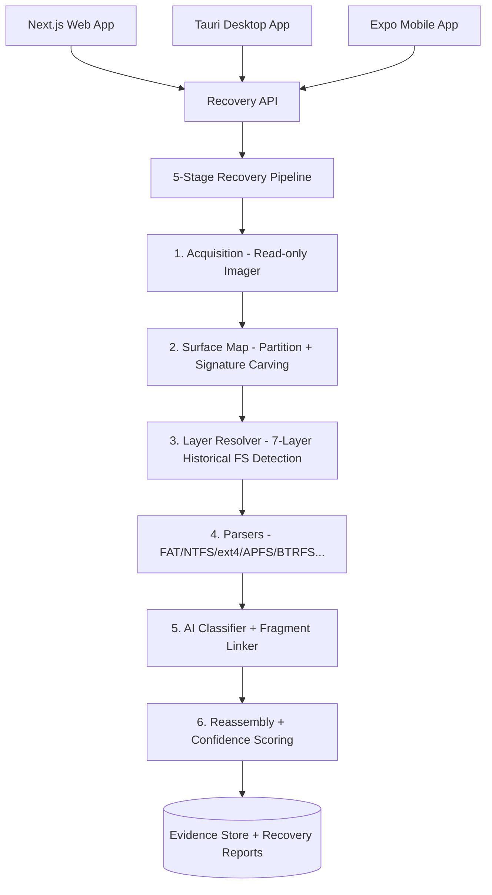
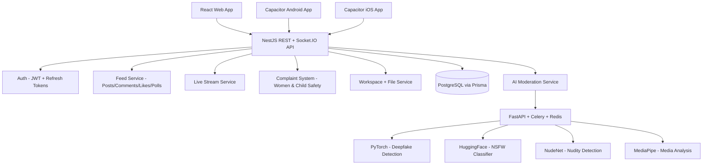
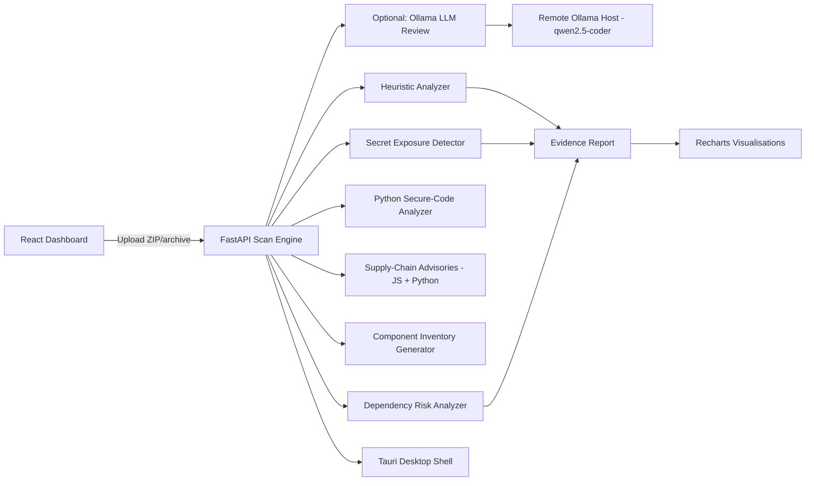
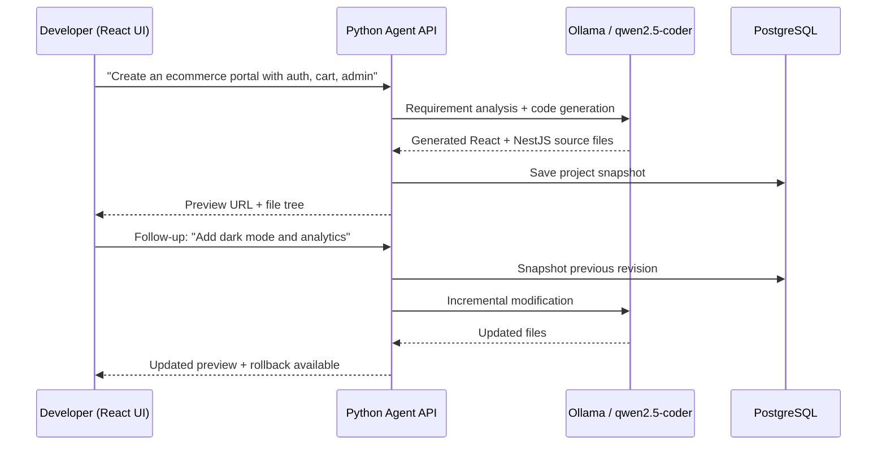
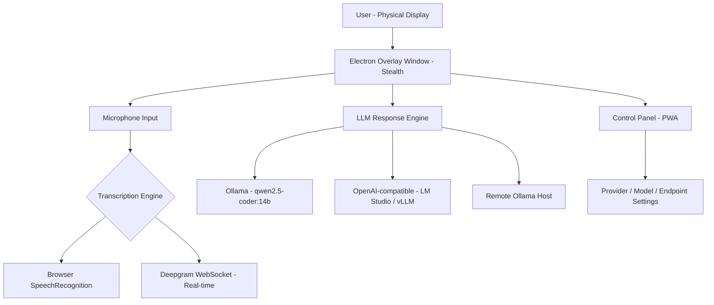
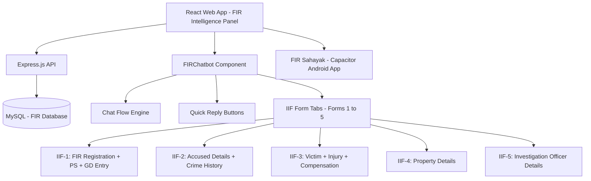

<div align="center">

# 👋 Hi, I'm Ankit Vishwakarma

### Full-Stack Engineer · AI Developer · Cybersecurity & Forensics Specialist

[](mailto:ankitvishwakarma80803@gmail.com)
[](#)
[](#)
[](#)

</div>

---

## 🧠 About Me

I'm a **senior full-stack & AI engineer** who builds production-grade platforms at the intersection of **AI, cybersecurity, and automation**. My work spans stealth desktop tools, AI forensics platforms, government safety systems, crypto trading UIs, and AI agent frameworks — always end-to-end, always production-ready.

- 🔭 Currently building: **AI-powered security & forensics platforms**, **agentic developer tools**
- ⚡ Core stack: Node js . React · TypeScript · Python · NestJS · FastAPI · Supabase · PostgreSQL · Ollama · Anthropic API
- 🤝 Available for: freelance projects, long-term contracts, AI/security consulting
- 📩 Contact: [ankitvishwakarma80803@gmail.com](mailto:ankitvishwakarma80803@gmail.com)

---

## 🛠️ Tech Stack

### Frontend


### Backend & APIs


### AI & ML


### Database & Infrastructure


### Mobile & Desktop


---

## 📌 Featured Projects

> Most projects were built for real use-cases — government portals, forensics labs, security research, and AI tooling. Source code is available on request where not under client confidentiality.

---

### 🔐 1. ZeroBreak — Desktop Security Testing Platform
**Status:** `Production` &nbsp;|&nbsp; **Type:** Cybersecurity SaaS

> A comprehensive penetration testing and autonomous security testing workbench with AI-assisted code analysis, Android security labs, and multi-stage merge-studio workflows.

**Tech:** `React` `TypeScript` `Vite` `shadcn/ui` `Supabase` `TanStack Query`

#### Problem
Security teams needed a single platform to run autonomous QA, pentest workflows, Android security analysis, and code auditing — without stitching together 5+ separate tools.

#### Solution
Built ZeroBreak as a modular security workbench with dedicated labs:

- **MergeStudio** — multi-phase pentest orchestration (basic → advanced → auto-test)
- **CodeSentinel** — static analysis and security code review
- **AndroidSecurityLab** — Android app security testing environment
- **AutonomousQA** — self-directed test generation and execution
- **DeliveryOps** — CI/CD integration and deployment security gates

#### Architecture



#### Key Features
- Autonomous pentest scheduling with configurable depth levels
- Android APK security analysis (permissions, network calls, hardcoded secrets)
- AI-assisted code sentinel for cross-language vulnerability detection
- Role-based access with membership tiers

---

### 🕵️ 2. ForensicAI — AI-Powered Digital Forensics Platform
**Status:** `Production` &nbsp;|&nbsp; **Type:** Cybersecurity / Forensics Tool

> A full-stack web-based forensic investigation platform combining 12+ forensic modules, chain-of-custody evidence logging, OSINT workflows, and an AI forensic analyst powered by the Anthropic API.

**Tech:** `Python` `Flask` `Anthropic API` `ReportLab` `OpenPyXL` `psutil` `HTML/CSS/JS`

#### Problem
Digital forensics investigators had to jump across 6–8 disconnected tools for disk analysis, memory inspection, OSINT lookups, and report writing. Evidence integrity and chain of custody were handled manually via spreadsheets.

#### Solution
Built a unified forensics dashboard with modules covering the full investigation lifecycle:

| Module | Capability |
|---|---|
| Disk & File Forensics | Metadata, deleted artifacts, hidden files, suspicious executables |
| Memory Forensics | Live processes, command lines, loaded modules, suspicious connections |
| Network Forensics | Interfaces, DNS, WHOIS, GeoIP, port scanning, PCAP review |
| OSINT Engine | Domain, IP, email, username, phone number intelligence |
| Log Analyzer | Failed logins, brute-force patterns, web attack signatures |
| Timeline Engine | File activity and system artifact reconstruction |
| Hash Engine | SHA-256 generation, verification, tamper detection |
| AI Analyst | Anthropic API — interprets findings, suggests next steps, generates narratives |
| Report Generator | Court-ready PDF reports + Excel evidence export |

#### Architecture



#### Results
- 12 active forensic modules in a single investigation dashboard
- SHA-256 evidence hashing + chain-of-custody records for court admissibility
- AI analyst generates formal investigation narratives from raw findings
- PDF & Excel export for legal and compliance reporting

---

### 💾 3. DeepRecover — AI Data Recovery Platform
**Status:** `Production` &nbsp;|&nbsp; **Type:** System Utility / AI Tool

> Multi-surface (web + desktop + mobile) data recovery platform with AI file classification, multi-filesystem parsers, fragment linking, and 7-layer historical disk recovery. Supports FAT, exFAT, NTFS, ext4, HFS+, APFS, BTRFS, XFS, ReFS, F2FS, and UDF.

**Tech:** `Python` `Next.js` `Tauri` `Expo (Mobile)` `Supabase` `PostgreSQL` `PyInstaller`

#### Architecture



#### Key Capabilities
- Recovers across 10+ filesystem formats including cross-format reformats (exFAT → APFS)
- AI file classifier using Shannon entropy + block-entropy profiles + magic-byte detection
- Fragment linker for reassembling split/deleted files
- 7-layer historical disk recovery — detects previous FS generations still on the medium
- RAID assembler for multi-disk recovery scenarios

---

### 🛡️ 4. CyberWorrios — Social Safety Platform with AI Moderation
**Status:** `Production` &nbsp;|&nbsp; **Type:** Social Platform / Civic Tech (Android + iOS + Web)

> A community safety platform with real-time feed, live streaming, women & child complaint reporting, workspace collaboration, and a self-hosted AI moderation service for deepfake/nudity/NSFW detection.

**Tech:** `React` `TypeScript` `NestJS` `PostgreSQL` `Prisma` `Socket.IO` `Capacitor` `Redis` `PyTorch` `HuggingFace` `FastAPI` `Celery`

#### Architecture



#### Key Features
- Full social feed with posts, comments, likes, polls, and suggestions
- Real-time notifications and live streaming with Socket.IO
- Women & child safety complaint filing with district-level routing
- **Self-hosted AI Moderation:** deepfake signals, nudity detection, AI-generated image probability — all running locally (no third-party API)
- Multi-platform: web + Android + iOS from a single codebase via Capacitor
- Role-based access control with workspace collaboration

---

### 🔍 5. ZeroBreak CodeReview — AI Code Security Scanner
**Status:** `Production` &nbsp;|&nbsp; **Type:** Developer Security Tool

> A local-first AI code security scanner that runs on uploaded source archives. Consolidates evidence-backed heuristic analysis, multi-language static scanning, secret detection, supply-chain advisories, and optional remote LLM review — all in a React dashboard backed by FastAPI.

**Tech:** `React` `Vite` `FastAPI` `Python` `Ollama` `Tauri` `TanStack Query` `Recharts`

#### Architecture



#### Key Features
- Works fully offline — no cloud dependencies
- Connects to a remote Ollama host for AI-assisted review (qwen2.5-coder)
- Cross-language support: Python, JavaScript, TypeScript, and more
- Detects hardcoded secrets, vulnerable dependencies, unsafe patterns
- Tauri desktop shell wraps the web app for native distribution

---

### 🤖 6. AI AgentDev Studio — Natural Language App Generator
**Status:** `Production` &nbsp;|&nbsp; **Type:** AI Developer Tool

> An AI agent that generates complete React + NestJS applications from natural language requirements. Supports local Ollama models (qwen2.5-coder), OpenAI-compatible endpoints, and LM Studio. Includes a React UI with live preview, code explorer, project threading, and rollback.

**Tech:** `Python` `React` `Vite` `NestJS` `PostgreSQL` `Ollama` `FastAPI`

#### Architecture



#### Key Features
- Generates production-quality React + NestJS apps from a single prompt
- Project threading — follow-up prompts modify the same generated codebase
- Automatic revision snapshots with one-click rollback
- Runs fully local: Ollama with qwen2.5-coder:14b (no OpenAI API needed)
- Fallback chain: `qwen2.5-coder:14b → qwen2.5-coder:7b → qwen2.5:latest`
- Topic-aware branding: SVG logos, hero visuals, section copy generated per app type

---

### 🎤 7. InterviewAI Agent — Stealth AI Interview Assistant
**Status:** `Production` &nbsp;|&nbsp; **Type:** Productivity / AI Tool

> An Electron + PWA stealth assistant that listens to interview questions via microphone, transcribes in real time (browser SpeechRecognition or Deepgram), and answers using a local LLM — with an overlay that is **invisible to Zoom, Meet, Teams, OBS, and all screen recorders**.

**Tech:** `Electron` `PWA` `Ollama` `Deepgram` `qwen2.5-coder:14b` `Web SpeechRecognition`

#### How the Stealth Works

| Platform | API | Effect |
|---|---|---|
| Windows | `SetWindowDisplayAffinity(WDA_EXCLUDEFROMCAPTURE)` | Excluded from all DWM capture |
| macOS | `setSharingType(NSWindowSharingNone)` | Excluded from CGWindowList |

Invisible to Zoom, Google Meet, Teams, Webex, OBS, Loom — visible only on your physical display.

#### Architecture



#### Key Features
- Real-time transcription with both browser API and Deepgram streaming
- Answers from a locally-running LLM (no cloud, no logs)
- PWA mode for browser-only use without Electron
- Supports any OpenAI-compatible endpoint (LM Studio, vLLM, llama.cpp)

---

### 📋 8. FIRGenie — FIR Intelligence Panel & AI Chatbot
**Status:** `Production` &nbsp;|&nbsp; **Type:** GovTech / Legal Tech

> An AI-powered chatbot interface for querying First Information Report (FIR) details, structured across IIF Forms 1–5. Includes guided conversation flows, quick-reply navigation, and drill-down into accused/victim/IO details. Mobile wrapper via Capacitor Android.

**Tech:** `React` `Express.js` `MySQL` `Capacitor (Android)` `CSS`

#### Architecture



#### Key Features
- Guided conversational flow for FIR lookup and drill-down
- IIF Forms 1–5 tabbed navigation with full data cards
- Search by FIR number, complainant name, or accused name
- Android app (FIR Sahayak) via Capacitor wrapping the same React frontend

---

### 🚗 9. MPSuraksha — MP Accident Reporting Dashboard
**Status:** `Production` &nbsp;|&nbsp; **Type:** GovTech / Public Safety

> A Madhya Pradesh government-facing accident reporting and analytics dashboard for real-time accident data submission, district-level tracking, and administrative review. Built for the MP Police / Road Safety authority.

**Tech:** `React` `TypeScript` `Vite` `shadcn/ui` `Supabase` `TanStack Query`

#### Key Features
- Accident incident reporting with location, severity, and vehicle details
- District-level analytics dashboard for MP administration
- Real-time data via Supabase subscriptions
- Role-based access: field officer vs. admin vs. analytics viewer

---

### 💰 10. CryptoTrade — Crypto Trading Platform
**Status:** `Production (Multi-version)` &nbsp;|&nbsp; **Type:** FinTech / Trading

> A multi-version crypto trading platform (4 iterations: ct, ct2, ct3, ct4) with real-time market data, portfolio tracking, and trade execution UI. Each version is a standalone React + Supabase app.

**Tech:** `React` `TypeScript` `Vite` `shadcn/ui` `Supabase` `TanStack Query`

#### Key Features
- Real-time crypto price feeds and portfolio P&L tracking
- Trade execution UI with order history and position management
- 4 production iterations showing progressive feature evolution
- Supabase for auth, real-time data sync, and portfolio persistence

---

### 🥋 11. WuShump — MP Wushu Sports Portal
**Status:** `Production` &nbsp;|&nbsp; **Type:** Sports Management / GovTech

> A sports management portal for the Madhya Pradesh Wushu Association — handling athlete registration, event scheduling, results management, and coach/admin workflows.

**Tech:** `React` `TypeScript` `Vite` `shadcn/ui` `Supabase` `TanStack Query`

#### Key Features
- Athlete registration and profile management
- Event and competition scheduling
- Results and medal tracking
- Admin panel for federation officials

---

## 🔐 Private Client Projects

```
╔══════════════════════════════════════════════════════════════════╗
║                  PRIVATE / RESTRICTED PROJECTS                   ║
╠══════════════════════════════════════════════════════════════════╣
║  • ZeroBreak Security Platform     (React · Python · Supabase)  ║
║  • ForensicAI Investigation Suite  (Python · Flask · Anthropic) ║
║  • DeepRecover Data Recovery       (Python · Next.js · Tauri)   ║
║  • CyberWorrios Safety Platform    (NestJS · React · Capacitor) ║
║  • AI AgentDev Studio              (Python · React · Ollama)    ║
║  • InterviewAI Stealth Agent       (Electron · Deepgram)        ║
║  • FIRGenie Intelligence Panel     (React · Express · MySQL)    ║
║  • MPSuraksha Accident Dashboard   (React · Supabase · GovTech) ║
╚══════════════════════════════════════════════════════════════════╝

Source code restricted due to client or operational confidentiality.
Architecture documents, case studies, and live demos available on request.
```

---

## 📈 GitHub Activity

<div align="center">


</div>

---

## 🤝 Let's Work Together

I'm available for:

- ✅ **AI integrations** — Anthropic, Ollama, OpenAI-compatible, LangChain
- ✅ **Cybersecurity & forensics tools** — pentest platforms, investigation dashboards
- ✅ **Full-stack SaaS development** — React + NestJS/FastAPI + PostgreSQL
- ✅ **Cross-platform apps** — Web + Android + iOS + Desktop (Capacitor, Electron, Tauri)
- ✅ **GovTech & civic tech** — dashboards, reporting systems, safety platforms
- ✅ **AI agentic systems** — code generators, autonomous agents, LLM pipelines

📩 **Email:** [ankitvishwakarma80803@gmail.com](mailto:ankitvishwakarma80803@gmail.com)

> *"I build complete systems — from AI inference pipelines and forensic engines to cross-platform apps and government portals."*

---

<div align="center">

⭐ **Star a repo if you find the work useful!** ⭐

</div>
